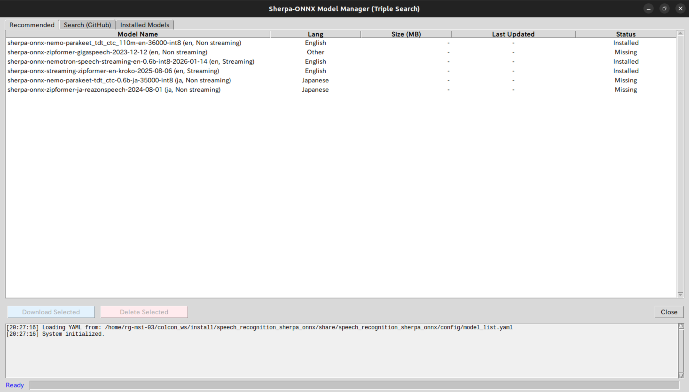
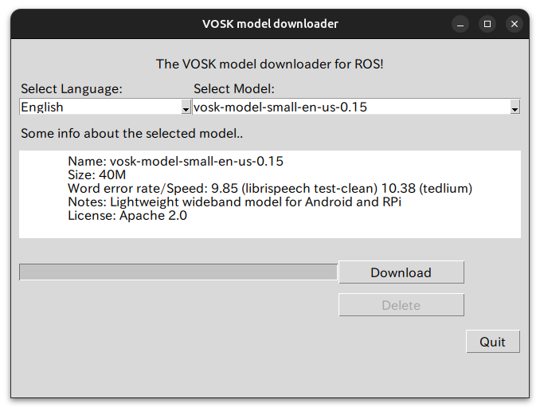

<a name="readme-top"></a>

[JA](README_detail.md) | [EN](README_detail.en.md)

[Back](README.en.md)

<!-- TABLE OF CONTENTS -->
<details>
  <summary>Table of Contents</summary>
  <ol>
    <li><a href="#whisper">Whisper</a></li>
    <li><a href="#sherpa-onnx">Sherpa-ONNX</a></li>
    <li><a href="#nemo-asr">NeMo ASR</a></li>
    <li><a href="#vosk">VOSK</a></li>
  </ol>
</details>

<a name="whisper-top"></a>

# Whisper

[Whisper](https://github.com/openai/whisper) is an automatic speech recognition (ASR) system developed by OpenAI, trained on 680,000 hours of multilingual and multitask supervised data collected from the web.

[faster-whisper](https://github.com/SYSTRAN/faster-whisper) is also supported, offering significantly faster inference and lower VRAM consumption while maintaining accuracy.

<p align="right">(<a href="#whisper-top">back to Whisper top</a>)</p>

## Installation

1. Navigate to the `install` directory of `sobits_speech_recognition`.
    ```sh
    cd ~/colcon_ws/src/sobits_speech_recognition/install/
    ```

2. Install the model.
    ```bash
    bash whisper.sh
    ```

<p align="right">(<a href="#whisper-top">back to Whisper top</a>)</p>

## Downloading Models
1. Launch the GUI with the following command.
    ```sh
    ros2 run sobits_speech_recognition dl_whisper
    ```
2. Click on a model to select it.
3. Press the **Download** button to download the model.
4. Close when done.

- Installed models can also be listed with the following command.
    ```sh
    ls ~/.sobits_speech_recognition/whisper_models/
    ```

## Launch and Usage

1. In Ubuntu Settings, set the sound input device to the microphone you wish to use.

2. Launch [whisper.launch.py](launch/whisper.launch.py).
    ```bash
    ros2 launch sobits_speech_recognition whisper.launch.py
    ```

3. Send a goal from an Action Client.
    - `timeout_sec`: Duration in seconds to keep the microphone open. A negative value keeps the microphone open and returns feedback until a cancel is sent.
    - `silent_mode`: When `true`, no sounds play at the start or end of recognition.
    - `feedback_rate`: Interval (in seconds) for returning intermediate recognition results when `use_feedback` is `True` and `vad_name` is `None`.
    ```sh
    ros2 action send_goal /speech_recognition sobits_interfaces/action/SpeechRecognition "timeout_sec: 5
    silent_mode: false
    feedback_rate: 0.5" -f
    ```

<p align="right">(<a href="#whisper-top">back to Whisper top</a>)</p>

## Parameters

The following are Whisper-specific parameters configurable in [whisper.launch.py](launch/whisper.launch.py).

| Parameter | Description | Default |
| --- | --- | --- |
| model_name | Whisper model to use *1 | small |
| language | Language for recognition. See [supported languages](https://github.com/openai/whisper/blob/main/whisper/tokenizer.py). | en |
| task | Task type: `transcribe` (speech-to-text) or `translate` (translate to English). | transcribe |
| use_prompt | Whether to use an initial prompt | False |
| backend | Inference backend: `whisper` or `faster-whisper` | whisper |
| device | Compute device (`cpu` or `cuda`). If empty, a GPU is used if available, otherwise CPU is selected automatically. | "" |
| compute_type | Quantization type for faster-whisper: `float16`, `int8_float16`, or `int8`. | float16 |

*1 Available sizes in ascending order: `tiny`, `base`, `small`, `medium`, `large`, `large-v2`, `large-v3`, `large-v3-turbo`.
faster-whisper supports the same model sizes with faster and more memory-efficient inference.
See the [model list](https://huggingface.co/collections/openai/whisper-release-6501bba2cf999715fd953013) for details.

- Parameters other than `model_name`, `backend`, `compute_type`, `use_feedback`, `vad_name`, and echo cancellation-related parameters can be changed after launching.
    - Example: change `min_wipe_duration` to 0.1
        ```sh
        ros2 param set /stt_server min_wipe_duration 0.1
        ```

<p align="right">(<a href="#whisper-top">back to Whisper top</a>)</p>

## Prompt

Use [config/whisper_prompt.yaml](config/whisper_prompt.yaml) to specify a prompt or context given to the model.

Providing specific words, phrases, or proper nouns in advance guides the model's predictions and can improve recognition accuracy.

<p align="right">(<a href="#whisper-top">back to Whisper top</a>)</p>

<a name="sherpa-top"></a>

# Sherpa-ONNX

Sherpa-ONNX integrates the [sherpa-onnx](https://github.com/k2-fsa/sherpa-onnx) speech recognition engine, which leverages ONNX Runtime, into ROS 2 Action communication.

It runs on CPU environments and supports both streaming recognition (real-time, incremental) and batch recognition (offline, file-based), with access to a vast selection of models.

<p align="right">(<a href="#sherpa-top">back to Sherpa top</a>)</p>

## Installation

1. Navigate to the `install` directory of `sobits_speech_recognition`.
    ```sh
    cd ~/colcon_ws/src/sobits_speech_recognition/install/
    ```

2. Install the model.
    ```bash
    bash sherpa.sh
    ```

<p align="right">(<a href="#sherpa-top">back to Sherpa top</a>)</p>

## Downloading Models

1. Launch the GUI with the following command.
    ```sh
    ros2 run sobits_speech_recognition dl_sherpa
    ```
  - The following interface will appear.
  
      - **Recommended**: Displays recommended models.
      - **Search (GitHub)**: Fetches the currently available models from GitHub. Up to 3 keywords can be specified to filter results. Models that may not work on your environment are shown in red.
      - **Installed Models**: Shows the list of already-installed models. Installed models can be removed using the **Delete Selected** button.

    <details>
    <summary><b>Notes on Model Selection</b></summary>

    - Model performance and resource requirements vary by size and environment. The following is for reference only.
    - **Streaming models**: Process audio incrementally in real time.
      - **transducer**: Primarily designed for streaming but can also be used for offline inference.
      - **wenet_ctc**: Known for stable operation; widely used in industrial applications.
      - **zipformer2_ctc**: Low-latency and efficient; well-suited for streaming (also usable offline).
      - **paraformer**: Designed for low-latency, high-speed operation; lightweight variants are suitable for embedded use.
      - **nemo_ctc**: High accuracy but heavier than other lightweight models on CPU (typically intended for GPU use).
      - **t_one_ctc**: Targets an extremely lightweight footprint; effective for CPU-constrained environments.

    - **Batch models**: Process audio files in bulk.
      - **whisper**: High accuracy and multilingual support with translation capability; computationally intensive (large models require GPU).
      - **sense_voice**: Supports emotion detection and ITN (inverse text normalization) for feature-rich transcription.
      - **nemo_canary**: Provides multilingual recognition and high-accuracy translation.
      - **transducer**: Primarily for streaming but also supports offline processing.
      - **moonshine**: Well-balanced between accuracy and speed.
      - **fire_red_asr**: High accuracy but tends to consume significant memory.
      - **paraformer**: Can operate in batch mode; efficient even in resource-limited environments.
      - **zipformer**: Efficient and low-latency; usable for both streaming and offline processing.
      - **dolphin**: A general-purpose multilingual model targeting low memory usage.
      - **medasr**: Suited for dictation tasks involving medical terminology.
      - **telespeech**: Trained on large-scale data; shows high accuracy particularly for Chinese.
      - **omnilingual**: A multilingual ASR model designed to support 1,600+ languages.
      - **tdnn**: A classic, lightweight neural architecture (TDNN-based); widely used as an ASR backbone.
      - **wenet**: Stable operation; widely applied in industrial use cases.
      - **nemo**: High recognition accuracy; speed and resource requirements depend on model size and environment.
      - **fun_asr_nano**: Ultra-compact model combined with an LLM; supports custom prompts.

    </details>

2. Click on a model to select it.
3. Press the **Download** button to download and extract the model.
4. Click **Close** when done.

- All available models can also be browsed [here](https://github.com/k2-fsa/sherpa-onnx/releases/tag/asr-models).

- Installed models can also be listed with the following command.
    ```sh
    ls ~/.sobits_speech_recognition/sherpa_models/
    ```

<p align="right">(<a href="#sherpa-top">back to Sherpa top</a>)</p>

## Launch and Usage

1. In Ubuntu Settings, set the sound input device to the microphone you wish to use.

2. Launch [sherpa.launch.py](launch/sherpa.launch.py).
    ```bash
    ros2 launch sobits_speech_recognition sherpa.launch.py
    ```

3. Send a goal from an Action Client.
    - `timeout_sec`: Duration in seconds to keep the microphone open. A negative value keeps the microphone open and returns feedback until a cancel is sent.
    - `silent_mode`: When `true`, no sounds play at the start or end of recognition.
    - `feedback_rate`: Interval (in seconds) for returning intermediate recognition results when `use_feedback` is `True` and `vad_name` is `None`.
    ```sh
    ros2 action send_goal /speech_recognition sobits_interfaces/action/SpeechRecognition "timeout_sec: 5
    silent_mode: false
    feedback_rate: 0.5" -f
    ```

<p align="right">(<a href="#sherpa-top">back to Sherpa top</a>)</p>

## Parameters

Sherpa-ONNX has two types of parameters: those configurable in [sherpa.launch.py](launch/sherpa.launch.py) and those configurable in [sherpa_params.yaml](config/sherpa_params.yaml).

The following parameters can be set in [sherpa.launch.py](launch/sherpa.launch.py).

| Parameter | Description | Default |
| --- | --- | --- |
| model_name | Name of the speech recognition model folder | sherpa-onnx-streaming-zipformer-en-kroko-2025-08-06 |
| device | Compute device. Currently only `cpu` is supported. | cpu |
| config_path | Path to the per-model parameter configuration file | [config/sherpa_params.yaml](config/sherpa_params.yaml) |

- Parameters other than `model_name`, `use_feedback`, `vad_name`, and echo cancellation-related parameters can be changed after launching.
  - Example: change `min_wipe_duration` to 0.1
    ```sh
    ros2 param set /stt_server min_wipe_duration 0.1
    ```

[sherpa_params.yaml](config/sherpa_params.yaml) allows per-model-type configuration.

- `global_settings`: Parameters common to all models.

  | Parameter | Description | Default |
  | --- | --- | --- |
  | decoding_method | Search algorithm: `greedy_search` or `modified_beam_search` | greedy_search |

    - `greedy_search`: Speed-first mode that selects the single most probable candidate. Low overhead and fast response, but slightly lower accuracy.
    - `modified_beam_search`: Accuracy-first mode that explores multiple candidates in parallel. More accurate results in context, but increases CPU load.

- `streaming_models`: Models that process audio incrementally in real time.

  <details>
  <summary><b>Streaming Model Parameters</b></summary>

  - The following parameters are common to all streaming models.

    | Parameter | Description | Default |
    | --- | --- | --- |
    | enable_endpoint_detection | Enable automatic segmentation based on silence detection. When `true`, the end of speech is detected automatically. | false |
    | rule1_min_trailing_silence | Silence duration (seconds) before speech starts. Lower values make detection faster but more sensitive to noise. | 2.4 |
    | rule2_min_trailing_silence | Silence duration (seconds) within an utterance to trigger a split. Lower values finalize results faster but may cut off mid-speech. | 1.2 |
    | rule3_min_utterance_length | Maximum continuous duration (seconds). Exceeding this forces recognition to finalize and split. | 20.0 |

  - The following parameters can be configured individually per model type.
    - `num_threads` is configurable for each model type.

      | Parameter | Description | Default |
      | --- | --- | --- |
      | num_threads | Number of CPU threads used for inference. Higher values speed up processing but increase CPU load. | 2 |

    - `transducer`

      | Parameter | Description | Default |
      | --- | --- | --- |
      | max_active_paths | Number of candidates to explore. Higher values improve accuracy but increase processing cost. | 4 |
      | blank_penalty | Penalty for silence tokens. Higher values make the model more eager to output characters. | 0.0 |
      | temperature_scale | Controls prediction diversity. Higher values favor more confident outputs. | 2.0 |

    - `wenet_ctc`

      | Parameter | Description | Default |
      | --- | --- | --- |
      | chunk_size | Processing unit size (frames). Smaller values reduce latency but reduce contextual understanding. | 16 |
      | num_left_chunks | Number of past chunks to reference. More chunks improve accuracy but increase computation. | 4 |

    - `zipformer2_ctc`

      | Parameter | Description | Default |
      | --- | --- | --- |
      | ctc_max_active | Maximum number of states retained during CTC decoding. Larger values improve precision. | 3000 |

    - `paraformer`, `nemo_ctc`, and `t_one_ctc` only support `num_threads` as an individual parameter.

  </details>

---
- `batch_models`: Models that process audio in bulk (offline).

  <details>
  <summary><b>Batch Model Parameters</b></summary>

  - The following parameters can be configured individually per model type.
    - `num_threads` is configurable for each model type.

      | Parameter | Description | Default |
      | --- | --- | --- |
      | num_threads | Number of CPU threads used for inference. Higher values speed up processing but increase CPU load. | 2 |

    - `whisper`

      | Parameter | Description | Default |
      | --- | --- | --- |
      | language | Target recognition language (e.g., `ja`, `en`). `auto` enables automatic detection. | "en" |
      | task | Processing mode: `transcribe` or `translate`. | "transcribe" |
      | tail_paddings | Number of padding frames at the end of audio. `-1` uses the model's optimal value automatically. | -1 |

    - `sense_voice`

      | Parameter | Description | Default |
      | --- | --- | --- |
      | language | Target language: `auto`, `zh`, `en`, `ja`, `ko`, etc. | "auto" |
      | use_itn | Whether to normalize numbers and symbols into readable form. | true |

    - `nemo_canary`

      | Parameter | Description | Default |
      | --- | --- | --- |
      | src_lang | Language of the input audio. | "en" |
      | tgt_lang | Language of the output text. | "en" |

    - `transducer`

      | Parameter | Description | Default |
      | --- | --- | --- |
      | max_active_paths | Number of candidates to explore. Higher values improve accuracy but increase processing cost. | 4 |
      | blank_penalty | Penalty for silence tokens. Higher values make the model more eager to output characters. | 0.0 |

    - `moonshine`, `fire_red_asr`, `paraformer`, `zipformer`, `dolphin`, `medasr`, `telespeech`, `omnilingual`, `tdnn`, `wenet`, and `nemo` only support `num_threads` as an individual parameter.

  </details>

<p align="right">(<a href="#sherpa-top">back to Sherpa top</a>)</p>

<a name="nemo-top"></a>

# NeMo ASR

NeMo ASR uses the automatic speech recognition (ASR) capability of the [NeMo Framework](https://github.com/NVIDIA/NeMo). Use on a PC with a GPU is recommended.

The [NVIDIA NeMo Framework](https://docs.nvidia.com/nemo-framework/user-guide/latest/overview.html) is a scalable, cloud-native generative AI framework built for researchers and PyTorch developers working in the areas of Large Language Models (LLM), Multimodal Models (MM), Automatic Speech Recognition (ASR), Text-to-Speech (TTS), and Computer Vision (CV).

<p align="right">(<a href="#nemo-top">back to NeMo top</a>)</p>

## Installation

1. Navigate to the `install` directory of `sobits_speech_recognition`.
    ```sh
    cd ~/colcon_ws/src/sobits_speech_recognition/install/
    ```

2. Install the model.
    ```bash
    bash nemo.sh
    ```

<p align="right">(<a href="#nemo-top">back to NeMo top</a>)</p>

## Launch and Usage

1. In Ubuntu Settings, set the sound input device to the microphone you wish to use.

2. Launch [nemo.launch.py](launch/nemo.launch.py).
    ```bash
    ros2 launch sobits_speech_recognition nemo.launch.py
    ```

3. Send a goal from an Action Client.
    - `timeout_sec`: Duration in seconds to keep the microphone open. A negative value keeps the microphone open and returns feedback until a cancel is sent.
    - `silent_mode`: When `true`, no sounds play at the start or end of recognition.
    - `feedback_rate`: Interval (in seconds) for returning intermediate recognition results when `use_feedback` is `True` and `vad_name` is `None`.
    ```sh
    ros2 action send_goal /speech_recognition sobits_interfaces/action/SpeechRecognition "timeout_sec: 5
    silent_mode: false
    feedback_rate: 0.5" -f
    ```

<p align="right">(<a href="#nemo-top">back to NeMo top</a>)</p>

## Parameters

The following are NeMo-specific parameters configurable in [nemo.launch.py](launch/nemo.launch.py).

| Parameter | Description | Default |
| --- | --- | --- |
| model_name | Name of the speech recognition model * | nvidia/parakeet-tdt-0.6b-v2 |
| device | Compute device (`cpu` or `cuda`). If empty, a GPU is used if available, otherwise CPU is selected automatically. | "" |

- To use a different model, edit the model name in [sobits_speech_recognition/download_utils/dl_nemo.py](sobits_speech_recognition/download_utils/dl_nemo.py) and run:
    ```sh
    ros2 run sobits_speech_recognition dl_nemo
    ```

- Parameters other than `model_name`, `use_feedback`, `vad_name`, and echo cancellation-related parameters can be changed after launching.
  - Example: change `min_wipe_duration` to 0.1
    ```sh
    ros2 param set /stt_server min_wipe_duration 0.1
    ```

<p align="right">(<a href="#nemo-top">back to NeMo top</a>)</p>


<a name="vosk-top"></a>

# VOSK

[Vosk](https://github.com/alphacep/vosk-api) is an offline speech recognition toolkit.

<p align="right">(<a href="#vosk-top">back to VOSK top</a>)</p>

## Installation

1. Navigate to the `install` directory of `sobits_speech_recognition`.
    ```sh
    cd ~/colcon_ws/src/sobits_speech_recognition/install/
    ```

2. Install the model.
    ```bash
    bash vosk.sh
    ```

<p align="right">(<a href="#vosk-top">back to VOSK top</a>)</p>

## Downloading Models

1. Launch the GUI with the following command.
    ```bash
    ros2 run sobits_speech_recognition dl_vosk
    ```

> **Note**
> You can use any language model listed in the [list of models compatible with Vosk-API](https://alphacephei.com/vosk/models).

2. The following GUI will appear.
    
    - For English:
      - Select language: English
      - Select model: vosk-model-small-en-us-0.15
    - For Japanese:
      - Select language: Japanese
      - Select model: vosk-model-ja-0.22
    - Installed models can also be listed with:
      ```sh
      ls ~/.sobits_speech_recognition/vosk_models/
      ```

<p align="right">(<a href="#vosk-top">back to VOSK top</a>)</p>

## Launch and Usage

1. In Ubuntu Settings, set the sound input device to the microphone you wish to use.

2. Launch [vosk.launch.py](launch/vosk.launch.py).
    ```bash
    ros2 launch sobits_speech_recognition vosk.launch.py
    ```

3. Send a goal from an Action Client.
    - `timeout_sec`: Duration in seconds to keep the microphone open. A negative value keeps the microphone open and returns feedback until a cancel is sent.
    - `silent_mode`: When `true`, no sounds play at the start or end of recognition.
    - `feedback_rate`: Interval (in seconds) for returning intermediate recognition results when `use_feedback` is `True` and `vad_name` is `None`.
    ```sh
    ros2 action send_goal /speech_recognition sobits_interfaces/action/SpeechRecognition "timeout_sec: 5
    silent_mode: false
    feedback_rate: 0.5" -f
    ```

<p align="right">(<a href="#vosk-top">back to VOSK top</a>)</p>

## Parameters

The following are VOSK-specific parameters configurable in [vosk.launch.py](launch/vosk.launch.py).

| Parameter | Description | Default |
| --- | --- | --- |
| model | VOSK model to use. Lightweight and large-vocabulary models are available. | vosk-model-small-en-us-0.15 |
| vosk_grammar | JSON grammar string to restrict the recognizer's vocabulary (empty = no grammar restriction). | "" |

<p align="right">(<a href="#vosk-top">back to VOSK top</a>)</p>
